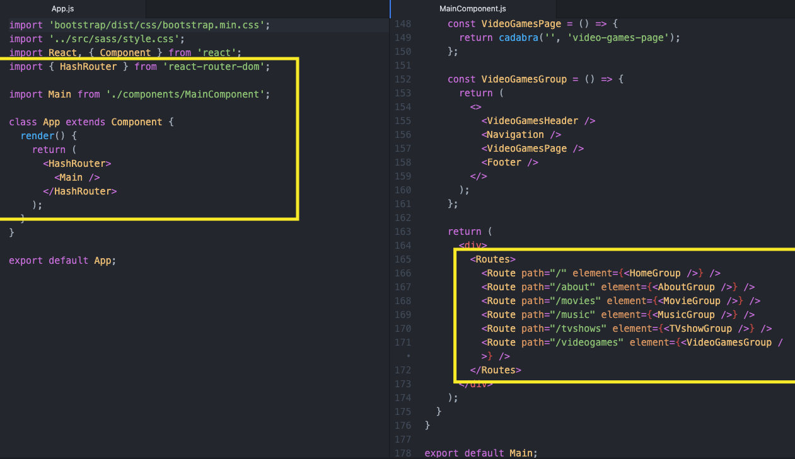

# Team Ludking Project

## by: Kurt Reynolds, William Santee, Cody Lillywhite

### Notes

- Using SASS, will need a pre-processor
- Switch is no longer supported past React v16. Now using Routes and Route. See screenshot. See how it is imported on MainCompenent.

  

### 02.04.2022 Updates
- created dev branch for merging subsequent branches into. the dev branch will be merged into main

### 02.03.2022 Updates

- fix bug for profile picture not staying after upload on profilepicture branch

### 02.02.2022 Updates

- added Firebase Storage
- added functionality to upload profile picture
- - need to fix bug as profile picture does not currently stay updated after uploading

### 02.01.2022 Updates

- put Navigation component on Profile page
- set up logout on Navigation component
- set up "logged in as ..." to display on Navigation component

### 01.29.2022 Updates

- added firebase v9.1.3 as dependency
- added LandingPage
- if you get a lot of errors after doing a git pull:
- - delete package-lock.json
- - run "yarn" in console
